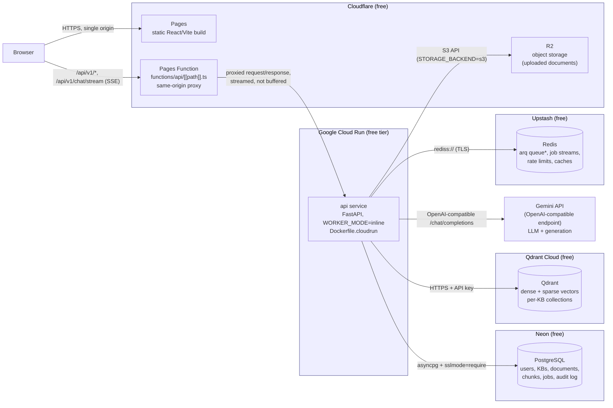
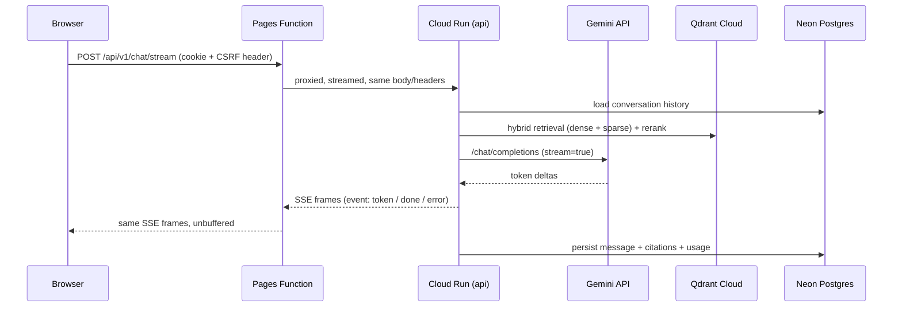

# Deployment architecture — free public demo

Companion to [`DEPLOYMENT.md`](DEPLOYMENT.md) (step-by-step commands) and
[`ARCHITECTURE.md`](ARCHITECTURE.md) (the application design this deployment
runs unmodified). This document explains *why* the pieces are arranged this
way, not just what to run.

## Topology



\* In the free deployment `WORKER_MODE=inline` (see below), so arq/Redis is
used for job *streaming/status* and rate limiting, not for a standing queue —
there is no separate worker process draining it.

## Why a same-origin proxy, not two origins

The app's auth model (`ARCHITECTURE.md` §24.2) is: an in-memory access token
plus an `HttpOnly` refresh-token cookie with CSRF double-submit protection.
That model requires the frontend and the API to be the **same origin** from
the browser's point of view — an `HttpOnly` cookie set by one origin is never
sent to a different one, and `SameSite=Lax` cookies don't cross origins either
for the cross-site POSTs this app makes (refresh, logout).

Cloud Run and Cloudflare Pages are, by construction, two different origins
(`*.run.app` vs `*.pages.dev`). Rather than changing the auth model to
something CORS-friendly across origins (which would mean loosening the cookie
model this app was deliberately built around), the deployment adds a proxy
hop so the browser only ever sees one origin:

```
Browser → https://<project>.pages.dev/...        (frontend + API, one origin)
              ├── /                → static SPA (Pages)
              └── /api/*           → Pages Function → Cloud Run
```

This is exactly what `frontend/nginx.conf` already does for the
docker-compose deployment (`location /api/` proxies to the `api` container on
the same nginx-served origin) — the Cloudflare Pages Function
(`frontend/functions/api/[[path]].ts`) is the same idea, implemented for a
host that has no nginx. **No backend or frontend application code changes**
were needed for this: `frontend/src/api/client.ts` already calls relative
`/api/v1/...` paths (`VITE_API_BASE` defaults to empty), and the backend's
CORS/CSRF/cookie settings were already fully configurable via environment
variables.

## The three ways this stays free (and where it stops being free)

### 1. Cloud Run: request-driven billing

Cloud Run bills for CPU/memory only while a request is being handled by
default (`--no-cpu-throttling` is *not* set) and scales to zero when idle —
that's the free-tier-friendly configuration used here. The tradeoff is cold
starts: after a period of no traffic, the first request pays for container
startup (loading the pre-baked fastembed models, connecting to Postgres,
etc.) before it can serve. This is a real, measurable latency cost that this
document does not attempt to hide — see *Known limitations* in
`DEPLOYMENT.md`.

### 2. The background-worker problem

`docs/ARCHITECTURE.md` §22 designs ingestion as: the API enqueues a job to
Redis (arq), and a **separate, always-running** `worker` process drains it.
Cloud Run has no free equivalent of a standing worker — a service only runs
while it has an incoming request, and a second min-instances=1 Cloud Run
service to host the worker would need to stay resident 24/7, which is not
covered by Cloud Run's free tier (that tier is a monthly compute-time
allowance, not a "N always-on instances" allowance).

The free deployment instead sets `WORKER_MODE=inline` (`app/config.py`,
`app/workers/queue.py`): the exact same task functions
(`app/workers/tasks.py`) that the arq worker would run are called directly,
synchronously, wherever the code today calls `queue.enqueue(...)` — no
separate process, no queue, and the ingestion pipeline itself
(`app/services/ingestion.py`) is untouched. This is a deployment-mode switch,
not a rewrite: `WORKER_MODE=queue` (the default) preserves 100% of the
existing docker-compose/production-with-a-real-worker behavior.

Trade-offs of `WORKER_MODE=inline`, stated plainly:

- **Upload requests block until ingestion finishes** (parse → chunk → embed →
  upsert), instead of returning immediately. Cloud Run's request timeout must
  be raised accordingly (`DEPLOYMENT.md` uses `--timeout=300`).
- **Cron jobs don't run**: reconciliation, trace GC, and the jobstream reaper
  (`app/workers/worker.py`'s `cron_jobs`) only exist in the standalone arq
  worker process. There is none in inline mode, so they simply don't happen.
  For a small demo KB this is a low-risk gap (nothing is corrupted — the
  system just doesn't self-heal or garbage-collect on a schedule); it is not
  an acceptable trade-off for a real multi-tenant production deployment,
  which should run a real `worker` process instead (a paid always-on Cloud
  Run instance, or any other host that can run a long-lived process).
- **Durable status is preserved**: `IngestionPipeline.run()` writes document
  and job status to Postgres regardless of who calls it, so "document stuck
  processing" style bugs are avoided the same way in both modes.

### 3. Object storage: R2 instead of local disk

Cloud Run's container filesystem is ephemeral per-instance — anything written
to local disk (the default `STORAGE_BACKEND=local`) is gone the moment the
instance is recycled or scaled down. The app already has a generic
S3-compatible storage backend (`app/infra/storage/s3.py`, using `aioboto3`)
driven by `STORAGE_BACKEND`, `S3_ENDPOINT_URL`, `S3_BUCKET`,
`S3_ACCESS_KEY`/`S3_SECRET_KEY`, `S3_REGION`. Cloudflare R2 speaks the S3 API,
so pointing those variables at an R2 bucket (`S3_ENDPOINT_URL=https://
<account-id>.r2.cloudflarestorage.com`, `S3_REGION=auto`) makes uploaded
documents durable with **no new storage code** — see `DEPLOYMENT.md` for the
exact variables.

## Data flow: chat request (streaming)



The Pages Function never buffers the response body — it constructs the
`Response` from the upstream `fetch()`'s `body` stream directly, so SSE
frames (including citations, which stream in progressively per
`app/services/chat.py`) reach the browser incrementally, the same as the
nginx `proxy_buffering off` configuration used for local/self-hosted
deployments.

## What did *not* change

To keep this a minimal, additive deployment (not a rewrite):

- `docker-compose.yml`, `backend/Dockerfile`, `frontend/Dockerfile`,
  `frontend/nginx.conf` — unchanged. Local development and the existing
  self-hosted Docker deployment path both still work exactly as before.
- Auth, RBAC, CSRF, cookies, citations, abstention, evaluation harness,
  provider abstraction — unchanged. All of it is driven by environment
  variables that were already there (or, for `DATABASE_URL`/`REDIS_URL`/
  `WORKER_MODE`, added as opt-in additions that default to the previous
  behavior).
- The ingestion pipeline, retrieval pipeline, and Gemini integration
  (`LLM_PROVIDER=openai` against Gemini's OpenAI-compatible endpoint) —
  unchanged; this was already supported and already tested against a real
  Gemini deployment before this deployment work started.
