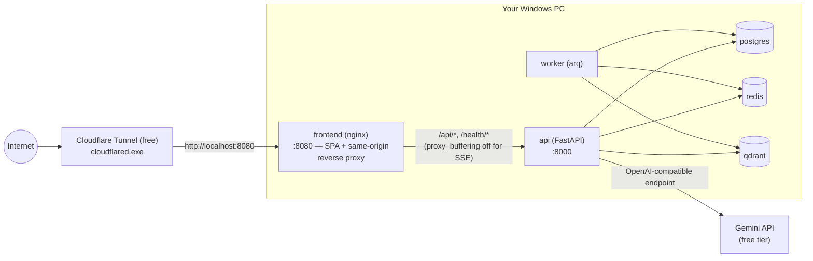

# Zero-Cost Public Demo

**Cost: $0.** No credit card, no billing account, no cloud compute bill —
this deployment runs entirely on your own Windows PC and uses only free
services with no paid tier involved.

**Infrastructure:**
- Windows PC (your machine, running Docker Desktop)
- Docker Compose — the same stack `docker compose up` already runs locally
- Cloudflare Tunnel (free) — the only "cloud" component, and it does not run
  your app; it just relays traffic to your PC
- Gemini API free tier — the LLM

This is **not** the [Cloud Run deployment](DEPLOYMENT.md) — that path (kept
intact in this repository as a future option) uses paid-tier-adjacent cloud
infrastructure and needs a GCP billing account. This document is the
alternative for getting a public URL with genuinely nothing to pay, ever,
by using your own PC as the server instead of a cloud provider.

---

## Architecture



The public origin is **one hostname** the whole way through: the tunnel
forwards to the frontend container's port (8080), and
`frontend/nginx.conf` — already in this repository, unmodified — reverse
proxies `/api/*` and `/health/*` to the `api` container on that same origin,
with `proxy_buffering off` specifically for streaming (SSE) endpoints. This
is exactly the "one public origin" the app's `HttpOnly` refresh-cookie +
CSRF double-submit auth model needs (`ARCHITECTURE.md` §24.2), and it
already existed before this document — **no application or nginx code
changed for this deployment path.**

---

## Prerequisites

- Docker Desktop, already installed and working (you've been using it —
  `docker compose up -d --build` from the repo root).
- A [free Cloudflare account](https://dash.cloudflare.com/sign-up) (email +
  password; no payment method requested for the free tier).
- A [Gemini API key](https://ai.google.dev/) (free tier).
- `.env` at the repo root with your Gemini key and, before you actually
  expose this publicly, the two settings in *Security notes* below.

---

## Install cloudflared on Windows

```powershell
winget install --id Cloudflare.cloudflared -e
```

Verify:

```powershell
cloudflared --version
```

(If PowerShell doesn't find it right after installing, open a new terminal
window — winget updates `PATH` for new processes, not ones already running.)

No Cloudflare login or account is required for what follows — a **Quick
Tunnel** (below) is fully anonymous. Skip straight to *Startup procedure*.

### If you get a domain later: named tunnel (optional, stable hostname)

A **named tunnel** gives you a stable hostname (e.g.
`rag.yourdomain.com`) that doesn't change between restarts — but Cloudflare
requires that hostname to live under a domain already added to your account
as a DNS zone. There is no free shared domain for this (unlike Cloudflare
Pages' `*.pages.dev`). **This document does not tell you to buy one** — if
you don't have a domain, use the Quick Tunnel path above; it costs nothing
and works today. If you already own a domain from anywhere, here's the
named-tunnel path:

```powershell
cloudflared tunnel login                      # opens a browser; pick your zone
cloudflared tunnel create erp-demo            # creates the tunnel, prints its UUID
cloudflared tunnel route dns erp-demo rag.yourdomain.com
```

Then create `%USERPROFILE%\.cloudflared\config.yml`:

```yaml
tunnel: erp-demo
credentials-file: C:\Users\<you>\.cloudflared\<tunnel-uuid>.json
ingress:
  - hostname: rag.yourdomain.com
    service: http://localhost:8080
  - service: http_status:404
```

```powershell
cloudflared tunnel run erp-demo
```

The credentials file `cloudflared tunnel login`/`create` writes to
`%USERPROFILE%\.cloudflared\` is a **secret** (it authorizes the tunnel) —
it is written outside this repository and must never be committed; nothing
in this repo creates, reads, or stores it.

---

## Startup procedure

**1. Start the application stack:**

```powershell
.\scripts\start-public-demo.ps1
```

This checks Docker is running, runs `docker compose up -d --build`, waits
for `/health/ready`, verifies the frontend, and prints the local URL plus
the exact `cloudflared` command to run next. It does **not** start the
tunnel itself — that stays a deliberate, separate action (see below).

**2. In a second terminal, start the tunnel:**

```powershell
cloudflared tunnel --url http://localhost:8080
```

Watch its output for a line like:

```
https://random-two-words.trycloudflare.com
```

That is your public URL, live immediately. Anyone with that link can now
reach your app for as long as this window and the stack above stay running.

**3. Verify** — open the printed URL in a browser (or on your phone, off
your home network, to confirm it's genuinely public) and confirm the app
loads.

---

## Shutdown procedure

```powershell
# Stop the tunnel: close its terminal window, or Ctrl+C in it.
# Then stop the stack:
docker compose down
```

`docker compose down` (without `-v`) leaves the named volumes intact — your
data (users, knowledge bases, documents, vectors) survives a restart.
Closing the `cloudflared` window immediately makes the app unreachable from
the internet again; the app keeps running locally at
`http://localhost:8080` either way until you also run `docker compose down`.

---

## Troubleshooting

| Symptom | Likely cause | Fix |
|---|---|---|
| `start-public-demo.ps1` fails at "Checking Docker" | Docker Desktop isn't running | Start Docker Desktop, wait for its whale icon to stop animating, re-run |
| Script times out waiting for `/health/ready` | First run — fastembed/reranker models (~150MB) are still downloading into the `modelcache` volume | Re-run with a longer `-TimeoutSeconds`, or just wait and check `docker compose logs api` |
| `cloudflared` prints connection errors / retries | No internet, or a very restrictive firewall blocking outbound QUIC/HTTP2 | Check your internet connection; cloudflared only needs outbound access, no inbound port-forwarding or router changes |
| Public URL loads but chat/login is broken while `localhost:8080` works fine | Cookie/CORS settings not updated for the public HTTPS origin | See *Security notes* — set `SESSION_COOKIE_SECURE=true` in `.env` and restart the stack |
| Public URL stopped working overnight | The PC slept, Docker Desktop stopped, or the tunnel window was closed | This is expected — see *Limitations* below. Nothing is wrong; restart via the steps above |
| `winget install` fails or `cloudflared` isn't found afterward | winget/Store agreement prompt, or PATH not refreshed | Open a new terminal; if winget itself fails, download the `.exe` directly from [Cloudflare's GitHub releases](https://github.com/cloudflare/cloudflared/releases) instead |

---

## Security notes

Verified in this repository, live, before writing this document:

- `.env` is gitignored and untracked (`git ls-files` confirms) — your Gemini
  key and any secrets never get committed.
- The refresh-token cookie is `HttpOnly` (confirmed via a real login: it's
  marked `#HttpOnly_` in a cookie jar, meaning JavaScript cannot read it),
  scoped to `/api/v1/auth`.
- CSRF is enforced for real: a request to `/auth/refresh` with a valid
  session cookie but **no** CSRF header is rejected
  (`403 CSRF token missing or invalid`), confirmed live.
- Logout actually ends the session: a refresh attempt after logout is
  rejected (`403 no session cookie`), confirmed live.
- Knowledge-base isolation is enforced: a second user requesting the first
  user's KB (directly, or via chat) gets `404` (not `403` — consistent with
  the architecture's "unknown vs. unauthorized both 404" design), confirmed
  live with two real registered users.

**Before you actually run the tunnel and share the URL, change two
settings in `.env`:**

```
SESSION_COOKIE_SECURE=true
```
The browser sees `https://` (Cloudflare terminates TLS at its edge), so the
refresh cookie must be marked `Secure` or it's needlessly also valid over a
plain HTTP connection. Currently this repo's default local `.env` has it
`false` (correct for plain `http://localhost` development) — checked in
this session and confirmed still `false` in the working `.env`.

```
JWT_SECRET=<a real random value, e.g. output of: openssl rand -hex 32>
```
The default (`change-me-in-production-please-32chars-min`) is fine for
local-only development but must not be used once the app is reachable from
the internet — checked in this session and confirmed the working `.env`
still has no `JWT_SECRET` override, i.e. is running on that default.

After changing either, `docker compose up -d --build` again (or just
`docker compose restart api worker` — no rebuild needed for an env change,
though `--build` doesn't hurt).

Also consider, once you're actually exposing this:
- `CORS_ALLOW_ORIGINS` — set to your tunnel's exact URL. It matters less
  here than in a two-origin deployment (the browser only ever talks to the
  proxied same-origin path), but keep it non-wildcard regardless — this
  codebase does not currently reject a literal `CORS_ALLOW_ORIGINS=*`
  at the config-validation layer, so simply never set it to `*`.
- `ALLOW_OPEN_REGISTRATION` — this session's test `.env` has it `true`
  (anyone can self-register). For a demo you're sharing selectively, that's
  probably fine; for a link you're posting publicly, consider `false` and
  creating accounts yourself via `rag user create`.
- `RATE_LIMIT_PER_MIN` / `RATE_LIMIT_BURST` — the defaults (120/40 per
  caller) apply here the same as anywhere else; lower them if you're
  worried about a public link driving unexpected Gemini API spend.

---

## Limitations

This is a **portfolio/demo deployment, not 24/7 hosted infrastructure.** The
public URL is reachable only while, simultaneously:

- the PC is powered on and not asleep/hibernating,
- Docker Desktop is running,
- the `docker compose` stack's containers are up,
- the `cloudflared` process is running, and
- your internet connection is up.

If any of those stop, the URL stops working until you restart them (see
*Startup procedure*). With a Quick Tunnel specifically, restarting
`cloudflared` also gives you a **new** random URL — anyone you'd shared the
old one with needs the new link. There is no notification or redirect from
an old Quick Tunnel URL to a new one.

No SLA, no uptime guarantee, no autoscaling — this is one process on one
consumer PC.
